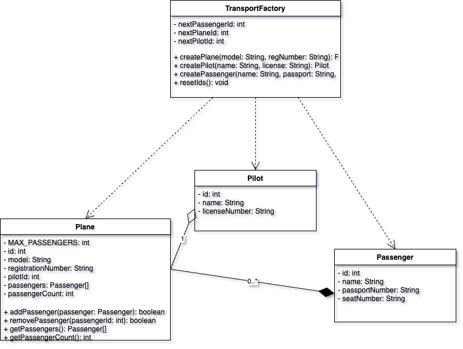
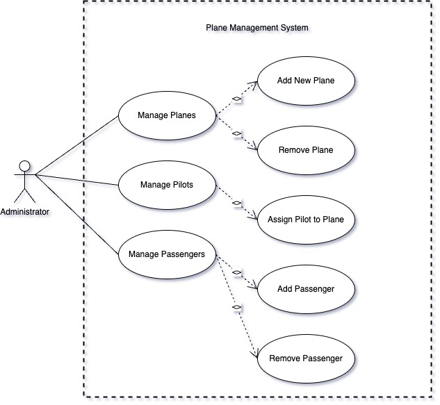
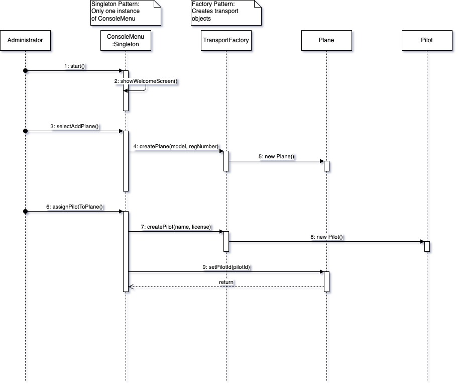

# Project Idea: **Plane Management System (CLI-based)**
A basic command-line interface application with a menu system.


## Project Structure

```
src/
└── main/
    └── java/
        └── com/
            └── javaprojectplane/
                └── cli/
                    ├── Main.java
                    ├── Plane.java
                    ├── Pilot.java
                    └── Passenger.java
```


#### Description:
The application will manage a simple system for tracking planes and their pilots. Users can perform basic operations like adding, viewing, and deleting planes and pilots, with data stored in arrays. The system will allow basic associations between planes and their assigned pilots.

---

### Features:

#### 1. **Manage Planes**:
   - Add a new plane.
   - View all planes.
   - Search for a plane by model or registration number.
   - Delete a plane.

#### 2. **Manage Pilots**:
   - Add a new pilot.
   - View all pilots.
   - Search for a pilot by name or ID.
   - Delete a pilot.

#### 3. **Plane-Pilot Assignment**:
   - Assign a pilot to a plane.
   - View the assigned pilot for a plane.

---

### Menu Design (CLI):
```plaintext
Plane Management System:
1. Manage Planes
   a. Add Plane
   b. View All Planes
   c. Search for a Plane
   d. Delete a Plane
2. Manage Pilots
   a. Add Pilot
   b. View All Pilots
   c. Search for a Pilot
   d. Delete a Pilot
3. Plane-Pilot Assignment
   a. Assign Pilot to Plane
   b. View Plane's Pilot
4. Manage Passengers
   a. Add Passenger to Plane
   b. View Plane's Passengers
   c. Remove Passenger from Plane
5. Exit
```

---

### System Design Diagrams
Below are the UML diagrams that illustrate the system's architecture, interactions, and structure:

1. **Class Diagram**: Shows the relationships between different classes in the system


2. **Use Case Diagram**: Illustrates the possible interactions between users and the system


3. **Sequence Diagram**: Demonstrates the flow of operations for pilot assignment


---

### Implementation Details:

#### Objects:
1. **`Plane` Class**:
   - Fields: `id`, `model`, `registrationNumber`, `pilotId`, `passengers[]`, `passengerCount`
   - Methods: Getters/Setters, `toString`, `addPassenger`, `removePassenger`, `getPassengers`

2. **`Pilot` Class**:
   - Fields: `id`, `name`, `licenseNumber`
   - Methods: Getters/Setters, `toString`

3. **`Passenger` Class**:
   - Fields: `id`, `name`, `passportNumber`, `seatNumber`
   - Methods: Getters/Setters, `toString`

#### Data Storage:
- Use arrays to store `Plane` and `Pilot` objects
- Each `Plane` object maintains its own array of `Passenger` objects
- Operations such as add, search, and delete will directly manipulate these arrays

The data persistence and abstraction will be implemented in the next phase of the project.

### Design Patterns Used:

#### 1. **Singleton Pattern**:
- Implemented in `ConsoleMenu` class
- Ensures a single instance of the menu system throughout the application
- Manages consistent UI state and user interaction

#### 2. **Factory Pattern**:
- Simple Factory implementation in `TransportFactory` class
- Centralizes object creation for Planes, Pilots, and Passengers
- Manages ID generation and instantiation logic

#### 3. **Partial MVC Pattern**:
- **Model**: Clear data models in `Plane`, `Pilot`, and `Passenger` classes
- **View**: `ConsoleMenu` class handling all UI rendering and user input
- **Controller**: Main class handling business logic and flow control
- Note: While not a strict MVC implementation, the separation of concerns provides a foundation for future enhancements

---

### Tools:
- **IDE**: IntelliJ IDEA, Eclipse, or VS Code.
- **UML**: Lucidchart, StarUML.

---

### Deliverables:
1. **Executable Java Application**:
   - A `.jar` file that runs on any machine with a JDK.
2. **Documentation**:
   - UML diagrams (Use Case, Class, Sequence).

---

Thank you for your time and effort.